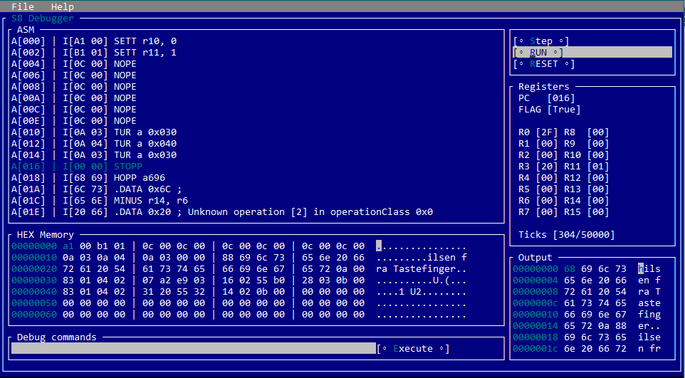

# SLEDE8 Debugger
### Dissasembler, Assembler og Debugger


Koden kunne ikke vært implementert uten PST sin Slede8 referanseimplementasjon.
Både assembler, instruction-parsing (brukt av disassembler) og runtime engine er en C# versjon av PST sin TypeScript implementasjon

Se https://github.com/pstnorge/slede8 for spesifikasjon

Denne koden kan fritt kopieres og brukes, pull requests er velkommen.


## Building 

Denne koden fungerer like fint på Windows som under Linux.
Kravene er at du har [.NET 6](https://dotnet.microsoft.com/download/dotnet/6.0) installert.
Deretter cloner du (eller laster ned Git repo)

```
    1. Installer .NET6 fra https://dotnet.microsoft.com/download/dotnet/6.0
    2. git clone https://github.com/RonnyA/S8Debugger.git
    3. cd S8Debugger\S8Console
    4. dotnet run
```

## Building Blazor

Om du ønsker å kjøre Blazor (Client side WebAssembly) versjonen
```
    1. cd S8Debugger\S8Blazor
    2. dotnet run
```

Siste build er deployet som en [Static Web App](https://brave-flower-00d404403.azurestaticapps.net/)


## Debugging SLEDE8

Debuggern kan kjøres om hverandre i Command mode, GUI mode og Blazor (WASM) 




[](https://brave-flower-00d404403.azurestaticapps.net/)


## Console commands

Execute "HELP" inside the console to get this listing

```
    D - Dissassemble [start] [length]
    M - Memory Dump  [start] [length]
    Limits itself to inside loaded image

    D!- Dissassemble [start] [length]
    M!- Memory Dump  [start] [length]
    Enables access to memory ourside loaded image

    INPUT - SET INPUT hexhexhex
    PC    - SET pc = xxx
    RUN   - Run program from 0 (Will compile source code first)
    RUN!  - Run program from 0 (Will not compile source code)
    REGS  - Dump registers
    RESET - Reset registers
    STEP  - Step PC [steps]
    TICKS - Set Max Ticks 0xNN
    UNITTEST [filename] - Run unit tests agains [filename]

    VERBOSE = Set Verbose output of RUN and STEP
    TERSE   = Remove verbose output of RUN and STEP
    ! = Change showaddress flag

    A    statement        - Assemble [statement]
    ASM  sledefil [s8fil] - Assemble and load into memory. Optionally save to S8 file
    ASM! sledefil         - Assemble, dont load into memory

    GUI - Enter GUI mode
    Q   - Quit
```
## Eksempel på en debug session

    LOAD C:\temp\sorter.S8  <= Last inn binær kode S8 fra filsystemet
    RUN                     <= Kjører koden
    INPUT 04AABB0211        <= Sett input (FØDE) til "04AABB0211"
    D 0 20                  <= Dissasmeble cpu instruksjoner fra minne posisjon 0 og 20 bytes fremover
    M 0 50                  <= List ut hex minnedata direkte (ingen dissasembling) fra posisjon 0 og 50 bytes fremover
    RESET                   <= Reset alle registre og klargjør for ny kjøring
    STEP (eller +)          <= Step en og en instruksjon
    STEP 10                 <= Step 10 instruksjoner
    VERBOSE                 <= Kjøre koden fra starten, men logg 
    RUN                     <= Kjøre koden fra starten, men siden VERBOSE er enablet så vises hver enkelt linje som kjøres sammne med registerinformasjon

## Eksempel på Assembly og kjøring
    LOAD c:\temp\sorter.slede8   <= Last inn slede8 kildekode og kompiler den til binær S8
                                    Koden kan nå debugges på samme måte som over

## Eksempel på "A statement"

    A SETT r1,0x44              <= Assembler koden "sett r1,0x44" og returnerer HEX verdi for S8 instruksjon
    A return 2 bytes
    >0x11 0x44
